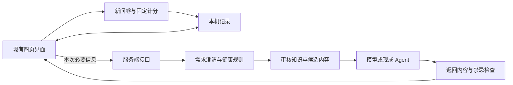

# 知养：MVP 技术方案 v0.2

日期：2026-09-13。状态：技术设计草案，已有配套题目、规则和内容初稿；尚未实施。用户已决定将模型选型及真实接入后置，先推进不依赖模型的工作。

依据：[产品方案 v0.5](01-产品设计方案.md)、[范围确认单 v0.5](02-MVP范围确认单.md)。配套：[测评设计稿](04-测评题目与计分设计稿.md)、[产品健康规则](05-产品健康规则.md)、[首批知识内容](06-首批知识内容与来源.md)。

## 1. 用产品语言说明这版怎么做

保留现有四个页面和视觉设计，增加三个可以分别调整的部分：重新设计的测评、当前浏览器里的记录管理、连接真实 Agent 的服务端接口。

用户的档案、测评、收藏和方案留在本机。需要 AI 回答时，页面把本次必要信息发给服务端；服务端结合健康规则与知识内容请求模型，并检查返回内容。用户决定保存后，结果才写入本机记录。

测评题目、评分和结果解释作为有版本的独立内容维护。更换题目不需要重做首页，换模型也不需要改写测评计分。

| 已确认范围 | 本方案对应设计 |
| --- | --- |
| D1：中药养生定位，开放健康问题，分层回答 | 不再用固定场景关键词作为问题白名单；把知识检索、禁忌与回答检查放到服务端 |
| D2：首版重新设计正式测评题目，旧题仅参考 | 新问卷配置、固定计分模块、独立结果记录与验证状态；不采用五题固定结果 |
| D3：A，无产品账号、本机保存 | 浏览器本地数据库；不建设登录、云端健康档案或跨设备同步 |

## 2. 当前实现与技术选择

当前项目是原生 HTML、CSS 和 JavaScript 模块，源文件位于 `dist/`，没有后端。`agent.js` 返回预设内容；`app.js` 同时承担页面、聊天、测评和保存逻辑；记录位于 `localStorage` 的 `zhiyang-demo-v1`。

| 部分 | 首版技术选择 | 原因 |
| --- | --- | --- |
| 页面 | 保留原生 HTML／CSS／JavaScript，按功能拆分模块 | 复用已认可的界面，避免为接 Agent 全面更换前端框架 |
| 本机记录 | IndexedDB，统一通过存储模块访问 | 适合保存多份结构化记录，可用事务处理方案更新和迁移；仍只在本浏览器内 |
| 测评计分 | 独立 JavaScript 纯函数＋有版本的问卷配置 | 相同答案与版本得到相同结果，便于复核，不让大模型决定分数 |
| 服务端 | Workers 兼容的轻量 JavaScript 服务，与页面同站点提供 `/api/agent` | 与现有 Sites 托管衔接，密钥留在服务端 |
| Agent 接入 | 独立 HTTP 适配器 | 可连接用户现成的 Agent API，或连接模型 API；页面使用同一套返回格式 |
| 首批知识 | 审核后的结构化条目和参考文本，先做小规模检索 | 不要求先部署向量数据库；内容可逐步增加，后续替换检索实现 |
| 验证 | `node:test` 验证纯逻辑和接口；真实浏览器验证页面与 IndexedDB | 覆盖功能变化，不给文案修改机械增加单元测试 |

IndexedDB 的本地对象存储与事务能力、Workers 同时服务静态内容和 API 的能力，以及 Node 内置测试运行器，分别参考 [MDN](https://developer.mozilla.org/en-US/docs/Web/API/IndexedDB_API/Using_IndexedDB)、[Cloudflare](https://developers.cloudflare.com/workers/static-assets/routing/worker-script/) 和 [Node.js](https://nodejs.org/api/test.html) 的官方文档。上述选型为本项目设计判断，尚未做部署验证。

当前 `.openai/hosting.json` 使用纯静态模式，该模式不能直接运行后端。实施时复用现有 Site 的 `project_id`，改为服务端构建；保留外观和行为，验证后再替换发布。不要把密钥写进 `dist/agent.js`，也不要另建一个重复 Site。

## 3. 模块分工与请求流程



建议源文件在实施时整理为以下结构；本轮尚未创建这些代码目录：

```text
src/client/       页面、聊天、测评流程、本机存储
src/shared/       问卷计分、数据结构与字段校验
src/server/       API、Agent 适配器、检索、健康规则与输出检查
content/          食养条目、参考文本、新问卷配置及版本说明
rules/            可执行规则配置及其来源
tests/            计分、规则、接口与状态逻辑测试
docs/             产品、题目设计、健康规则、技术与验证记录
dist/             实施后仅存放构建结果
```

独立模块不等于多个 Agent。首版采用一条清楚的处理流程，不引入复杂的多 Agent 调度或自主外部工具调用。

## 4. D2：重新设计题目与测评实现

### 4.1 内容设计和软件实现分别推进

已另交付 [测评题目与计分设计稿](04-测评题目与计分设计稿.md)，包括 32 道候选题、选项、覆盖、顺序和描述性计分草案；题量不是定稿，不设未经验证的正式个人判定门槛。题目、分数阈值及各维度关系按相应设计版本配置，不在代码里写死五题、六十题或某个判定分值。

每道题至少记录：稳定题目 ID、题目版本、题干、选项与编码、对应维度、计分方向、适用条件、依据、审核状态。每个计分版本明确缺失值、反向项、维度换算、判定条件及结果组合规则；不存在的规则不能由模型补齐。

问卷版本与计分版本绑定发布，发布后不原地改写。改题形成新版本，旧结果保留原版本；不能用新规则偷偷重算旧记录。题目尚未定稿时，可以开发问卷容器和测试接口，但不把占位题当正式问卷交付。

### 4.2 计分和结果

计分函数建议接口：`scoreAssessment(questionnaire, answers, eligibility)`。它只读取指定版本配置，输出维度分数、按规则得到的结果、适用说明与状态，不调用模型。

结果状态至少区分：未完成、不符合使用条件、试测参考、满足预定使用条件。问卷内容审核与测量验证状态分别记录；工程测试通过只能证明计分代码符合规则，不能证明新题目已经具有足够的测量可靠性。

用户完成问卷后，先查看结果，再决定保存。允许重新测评；新结果作为新记录，不覆盖原答卷。默认查看最新一次适用记录，同时可查看或移除以前的记录。草稿仅在本机保存，提交前检查必答项和答案编码。

现有五题固定“平和质”只作为旧原型资料。无论旧档案里是否保存该字段，都不得自动升级成新问卷结果或传给真实 Agent 当个人体质。

### 4.3 与 Agent 的关系

用户可以在不测评的情况下咨询。只有结果满足事先规定的使用条件、用户选择用于本次咨询时，才提供结果摘要；默认不上传整份答卷。摘要带问卷版本、计分版本、时间和验证状态，并明确为用户端提供的参考资料。

服务端只接受当前允许使用的版本和状态，不能因为客户端传来“已验证”字段就信任它。遇到旧版、试测或不适用结果，忽略该结果并解释，仍可继续一般健康咨询。体质摘要不用于自动排除基础病、用药或原料禁忌。

新题或实质改编题目需要对应内容与测量验证；不能直接继承参考问卷的验证结论。这里借鉴的是 [COSMIN 的测量工具内容效度方法](https://www.cosmin.nl/wp-content/uploads/COSMIN-methodology-for-content-validity-user-manual-v1.pdf)，它不等于对本问卷的认证。题目设计、专业审核与必要试测可逐步开展，不影响其他页面和接口先行实现。

## 5. D3：仅在本机保存什么

| 本机对象 | 主要字段 | 保存时机 |
| --- | --- | --- |
| 生活档案 | 目标、用餐习惯、饮食偏好、准备时间、修订号 | 用户主动保存 |
| 测评草稿 | 问卷版本、已答题目、进度 | 答题过程中本机暂存，可清除 |
| 测评记录 | ID、答案、维度分数、结果、版本、时间、验证状态 | 用户确认保存结果 |
| 我的方案 | ID、修订号、目标、分项安排、关联内容、来源版本、更新时间 | 保存新方案或确认更新 |
| 收藏 | 内容 ID、类型、收藏时间 | 点击收藏或取消 |
| 设置 | 数据发送说明版本、用户的使用选择 | 用户作出相应选择 |

聊天记录首版只留在当前页面会话内，刷新后不继续保留；已经保存的方案和测评不受此影响。没有产品账号，也不建设用于长期保存健康记录的服务端数据库。

使用统一存储模块处理读写。写入成功后才显示成功提示；事务失败、存储空间不足或浏览器不允许保存时，保留当前输入并说明失败。更新旧方案时在事务内核对修订号，避免旧标签页覆盖较新的改动。

从旧 Demo 迁移时，仅迁移合法的生活偏好、收藏和可读方案；旧方案保留“演示来源”标识，不能自动进入真实推荐。固定体质字段不迁移成正式结果。迁移要可重复执行而不重复创建记录，完成前不破坏旧数据。

“清除本地记录”同时清理新数据库、旧 Demo 存储键、当前会话和未完成请求。取消或清除后，迟到的模型回复不能再次写回页面或数据库。跨设备、跨浏览器、跨站点地址不自动同步，不能承诺清理浏览器数据后可找回。

## 6. Agent 接口与健康规则

### 6.1 前端只面对一个接口

使用 `POST /api/agent`，前端的 `getAgentReply()` 调用它。保留现有适配器的角色，逐步扩展字段，不再在前端用关键词分支假装真实理解。

请求字段建议如下，均需长度、类型和允许值检查：

| 字段 | 用途 |
| --- | --- |
| `requestId` | 对应本次请求和取消状态，防止旧回复串入新对话 |
| `message`、`history` | 当前问题和本次会话的必要上下文；控制总长度 |
| `profileContext` | 本次获准使用的生活条件，不发送称呼等无关字段 |
| `assessmentSummary` | 可选，满足使用条件且经用户选择的测评摘要 |
| `contentRef` | 从哪个内容详情进入咨询；服务端按合法 ID 读取正文，不信任客户端伪造的来源 |
| `activePlan` | 用户选中的旧方案、ID 与修订号；用于实际继续调整 |
| `requestedChange` | 如替换哪一餐；作为用户意图参考，不能绕过输出检查 |

返回统一结构：`requestId`、`mode`、`text`、`followUpQuestions`、`contentRefs`、`sources`、可选 `planDraft` 和 `ruleVersion`。`mode` 至少包含回答、需要澄清、建议专业帮助、服务暂不可用；它描述本轮处理结果，不是限定用户只能问某类问题。

`planDraft` 包含目标、采用的条件、带稳定 ID 的安排项、来源与说明。三餐包含早午晚，加餐另列；起居使用相应安排项。前端可以暂时转换为已有卡片结构，不让模型返回可执行 HTML。

### 6.2 一次回答的处理顺序

1. 检查输入、请求大小、来源和服务调用频率。用户消息、历史、旧方案及检索材料均不能改变系统规则。
2. 对已经明确需要优先帮助的情况走相应提示路径，不等普通推荐生成完毕。
3. 理解需求与必要条件。基础病、孕哺、年龄等作为条件，不当成统一拒答关键词；否定、未知和冲突信息分别处理。
4. 检索审核过的知识和具体候选内容。目录外问题仍可解释、追问和给出有依据的一般参考；缺乏证据时不编造来源或配方。
5. 对候选内容核查原料用途、适用人群、已知禁忌、相互作用和其他限制；必要条件缺失就继续澄清或限制具体推荐。
6. 让模型依据可用材料组织回答或方案，引用本次检索到的来源，不自由扩展药材与用量。
7. 对返回字段、内容 ID、引用、方案完整性及禁忌再检查。失败时返回清楚的解释或澄清请求，不把被移除的推荐仍留在正文里。
8. 前端展示草稿；用户主动保存，才写入本机数据库。

结构校验与内容 ID 检查不能代替医学语义审查。健康规则需要专业审核和带预期行为的对话用例；含糊情形不能因规则未命中就自动判为安全。规则覆盖不足时采用更有限的知识解释和合适下一步，不能声称已经排除风险。

### 6.3 规则文档如何落地

已形成 [产品健康规则初稿](05-产品健康规则.md)，包含规则 ID、适用情形、需要的信息、允许输出、限制行为、未知信息处理、依据和版本，以及首批对话验收用例。后续将可确定执行的部分对应到规则配置与测试；不能把一段文档塞进提示词后就视为已经执行。

规则优先于用户要求和检索内容。对具体原料采用“有支持／存在限制／资料未知”等明确状态；“没有记录禁忌”不自动等于允许推荐。用药与食药物质资料冲突时，说明需要核实，不让模型选择一个听起来合理的答案。

### 6.4 已保存方案怎样继续调整

客户端带入用户实际选中的方案；服务端重新检查完整方案与本次已知限制，给出保留 ID 的修改草稿。普通替换尽量只改变指定项；如果新发现的限制影响其他项，明确解释需一并调整之处。

原方案在用户确认保存前保持不变。新建方案使用新的 ID；更新方案携带原修订号，事务成功后递增修订号。不能继续使用当前 Demo 中按“减重／增重”固定 ID 覆盖所有同类方案的做法。

## 7. 知识、服务与数据边界

首批内容拆为“可引用的一般知识”和“可直接关联的食养条目”。每条记录包含 ID、类别、正文、来源、适用条件、审核状态与版本；可推荐原料还要有关联禁忌资料。未审核或已撤回条目不进入具体推荐候选。

先用可测试的分类、别名和文本检索，从小内容集获取相关材料。它只负责找材料，不作为问题白名单。后续可替换成向量检索、现成 Agent 的知识库或外部工具，仍保留引用核查和健康规则。首版不因“需要 Agent”就必须同时建设向量数据库、MCP 和模型微调。

模型或现成 Agent 的供应商、接口协议和费用尚未确定。用户已明确暂缓选型和真实接入，实际需要时再讨论，不作为当前开发前置条件。适配器先使用测试替身验证请求、返回、失败和取消；接口字段不绑定某家供应商。实际调用前再确定服务、费用、凭据、能力及数据处理方式。密钥只保存在服务端秘密配置，不进入源码、浏览器或日志。

未配置真实服务时，界面保持清楚的演示状态；自由输入不伪装成真实理解，未知场景说明尚未连接服务。未来真实服务故障也不静默切回预设答案并继续声称是 AI 结果。当前不购买额度、不设置任何模型为默认供应商、不发起付费模型调用。

本版服务端设计为单次请求处理，不主动长期保存问卷、健康档案或完整聊天。应用日志只记录必要的请求编号、耗时、错误类别和版本，不记录健康正文。托管和模型供应商是否保留请求数据，需要在选定服务后核对并告知；不能因为本应用没有数据库就承诺云端零留存。

无需产品账号不等于 API 无需保护。继续沿用当前受限访问，在真实调用入口增加适当的频率与用量限制；邀请内测时核实页面和 API 都受预期访问边界保护。具体限额在服务确定后配置，不把带有密钥的 API 暴露成可无限调用的公共入口。

## 8. 异常、测试与验收

首版先返回经过检查的完整回复，显示明确的等待与取消状态，不直接逐字展示尚未检查的模型输出。超时、限流和无效返回应可识别；重试不自动保存，不重复创建方案。新对话、关闭后重新开始或清除记录时，使旧请求失效。

| 验证模块 | 必须覆盖的行为 | 对应产品验收 |
| --- | --- | --- |
| 页面与咨询入口 | 四页、任意问题入口、长回复、手机输入区、详情返回 | A01、A09 |
| 对话与规则 | 完整三餐、局部替换、目录外问题、基础病与特殊人群、否定与未知、紧急情况、来源不足 | A02、A03、A04、A05、A12、A13 |
| 测评 | 新题目版本、适用条件、漏答、改答、计分样例与边界、重新测评、旧示例不升级 | A07、A14 |
| 本机记录 | 迁移、刷新持久化、更新旧方案、修订冲突、存储失败、收藏取消、清除 | A06、A08、A10、A11 |
| 接口与服务 | 超时、限流、取消、旧回复、无效结构、伪造来源 ID、正文与卡片一致、密钥不泄露 | A04、A08、A10、A13 |

纯函数和服务调用替身使用 `node:test`，浏览器负责真实存储与交互验证。健康场景评估由人工标注“应追问／可给哪些信息／不应输出什么”等预期行为，反复验证真实模型；不能只检查是否出现“请咨询医生”。测评软件测试与题目专业审核、用户试测及测量验证分别记录。

当前没有新增或运行这些应用测试，因为本轮只编写技术文档。表中的项目是实施后的验收要求，不能写成已通过。

## 9. 实施顺序与待落实资料

| 顺序 | 工作 | 可交付结果 |
| --- | --- | --- |
| 1 | 继续核对已形成的题目、计分、健康规则与首批内容初稿 | 当前稿件已可审阅；补齐来源与专业核对，不要求一次建成全部知识库 |
| 2 | 拆分现有代码、完成本机存储与测评容器 | 保留当前界面；真实计分接入已准备的问卷版本，未准备内容不伪装正式结果 |
| 3 | 增加同站点服务端、Agent 适配器和返回结构 | 先通过接口与异常测试，再接实际服务；可继续使用测试替身验证 |
| 4 | 需要真实联调时与用户讨论选型，再接服务、小知识集和规则检查 | 本阶段后置；验证开放问题、追问、依据、禁忌、完整方案与继续调整 |
| 5 | 完成相关测试与浏览器验收，发布内测版本 | 每个完整改动有 commit；如实列出专业验证状态与尚未开放的具体能力 |

当前可直接推进的是资料核对、代码模块拆分、本机存储、问卷容器、描述性计分及接口测试替身。到需要比较真实回答质量、验证调用成本与数据处理方式或进行真实服务联调时，再与用户讨论选型。无需现在提供平台、账号密码或在对话中粘贴密钥。

## 10. 发布与回滚

实施时把源文件迁出 `dist/`，保留可重复构建输出，锁定新增依赖。服务端构建需满足当前 Sites 的 Workers 兼容输出要求，包括 `dist/server/index.js`、静态资源和构建后的托管清单；纯静态配置需要相应调整，不能仅添加一个 API 文件就假定能运行。

先验证静态资源与 API 同站点可用，再按既有项目发布，维持当前访问范围；不在本轮文档更新时重新部署网站。应用更新与本机数据结构分别版本化，不在回滚代码时自动删库或重算旧测评。每次发布记录源码 commit、问卷版本、计分版本、规则版本和知识版本，便于定位问题。

这份文档只规定实施方式，不代表题目、规则、真实服务或生产能力已经完成。
