# 知养：诊断与优化建议

日期：2026-10-03。读者：产品负责人。依据：仓库当前源码、[产品设计方案 v0.6](01-产品设计方案.md)、[MVP 范围确认单 v0.6](02-MVP范围确认单.md)、[技术方案 v0.3](03-技术方案.md)、题目与健康规则初稿，以及本机安装、测试、构建和浏览器走查。

本轮只新增这份诊断和走查截图，没有改应用代码。

## 1. 结论

知养没有停在「页面还没做出来」。四页、本机档案、32 题试测、方案保存和修订、带安全闸门的模拟咨询，已经是一条能跑通的原型。`npm test` 46 项通过，`npm run build` 通过，`http://127.0.0.1:8765` 可以完成「减重咨询 → 生成三餐示例 → 保存 → 把鱼换成豆腐 → 修订号增加」。

推不动的原因是：确认过的 MVP 把三件都要外部条件的事写进了同一条验收线，而路线图的下一步恰好是其中一件已经被后置的事。

1. 正式体质判定（要专业审题、试测和测量验证，现有 32 题明确不做判定）。
2. 可推荐的专业内容（现有餐食、茶饮、专题全部是 `reviewStatus: pending`）。
3. 能开放回答健康问题的真实模型（选型已后置；当前 `/api/agent` 是关键词剧本）。

文档还停在「代码未改」。[范围确认单](02-MVP范围确认单.md) 阶段 4、[产品方案](01-产品设计方案.md) 第 5 节和第 13 节、[技术方案](03-技术方案.md) 第 8 节，仍按「只写了文档、五题固定平和质、旧方案没有真正带入」来描述。仓库事实已经往前走了一轮。人会同时觉得「壳子好像还没做」和「剩下的每一步都做不完」。

下一轮建议改成「可内测的食养安排」，从正式体质、开放问诊、RAG、MCP 里退出来。保留已经写好的紧急分流和特殊情况闸门，只让模型在现有食谱编号里组织三餐和替换。下面第 6 节按这个顺序排了五步。

## 2. 这次实际跑了什么

环境是 Node v22.14.0、npm 10.9.7。README 写的是 Node 26.8.1。在 22 上安装、测试和构建都通过，版本差异不构成阻塞。

| 命令 | 结果 |
| --- | --- |
| `npm ci` | 成功，4 个包，0 个已知漏洞 |
| `npm test` | 46 项通过，0 失败。覆盖紧急回复、配伍组合、计分边界、IndexedDB 迁移和修订冲突 |
| `npm run build` | 成功。浏览器包和 Worker 包都生成，日志写明没有配置模型 |
| `npm run dev` | `http://127.0.0.1:8765` 返回首页 200；`GET /api/agent` 返回 405（只接受 POST，符合设计） |
| 配图 | `public/assets/lunch.jpg`、`tea.jpg` 存在，页面请求返回 JPEG 200 |

浏览器走查使用桌面宽度，并在约 390×844 的手机宽度下看了首页和咨询框。虚构数据，没有填写真实健康信息。

已走通：

- 首页、食养、调养、我的四个页面，手机底部四栏可切换。
- 「健康减重」发出「我想健康减重」，助手给出追问和「生成三餐示例」，保存后「我的」出现同一份方案，修订号为 1。
- 「和助手一起调整」带入这份方案；「不吃鱼，换成豆腐」后保存，对话使用「保存对原方案的调整」。
- 「请分析完整舌象报告」得到「真实模型尚未接入」。
- 「我有高血压，日常吃什么需要注意？」得到专业核对提示，没有餐单。
- 「我现在呼吸困难」得到红色紧急提示和 120，没有方案卡、食谱卡或追问按钮。
- 食养详情、调养专题详情可以打开。
- 日常感受试测能进入第 1 题（共 32 题、八类选项），答一题后可以退出。没有答完 32 题。

截图在 [assets](assets/) 目录，正文对应小节会引用。

## 3. 对照 MVP：完成、做了一半、还没做

范围以确认单里的四页内测、D1 开放咨询、D2 正式测评、D3 只做本机保存为准。下表按现在的代码判断，不按 README 的自我介绍判断。

| 范围 | 现在的代码 | 判断 |
| --- | --- | --- |
| F01 四页和首页 AI 入口 | 首页、食养、调养、我的都由 `src/client/app.js` 渲染；侧栏和手机底栏都能进咨询 | 完成。文案和空状态仍是演示语气 |
| F02 开放咨询、追问、分层回答、失败处理 | `src/server/agent.js` 用正则分流。减重、增重、茶、作息、头痛有预设句；其他自由问题返回 `unavailable`。取消、15 秒超时、重试按钮在前端有 | 做了一半。接口形状在，理解能力不在 |
| F03 完整三餐、可选加餐、起居、单项替换 | 「生成三餐示例」有早午晚；「生成增重示例」多一道燕麦加餐；起居只能改准备时间。替换只认「不吃鱼 / 换成豆腐」 | 做了一半。一条剧本走通了，自由替换没有 |
| F04 食养详情与小种子集 | 餐食 4 条（早餐、午餐、晚餐、加餐）、茶饮 1 条、起居 1 条。方案要求约 8 个餐食搭配、2 个茶饮、2 个起居 | 做了一半，而且少于方案里的小种子集 |
| F05 六个专题和文章 | 专题 6 个，文章 2 篇。方案写 3 篇短文章 | 专题数量够；文章少 1 篇；全部待审核 |
| F06 档案、收藏、方案、本机保存 | IndexedDB `zhiyang-local-v2`，档案、收藏、方案、测评、草稿分库；清除会清旧键。咨询默认不上传饮食偏好 | 完成，符合 D3 方案 A |
| F07 从旧方案继续调整 | 调整时带上选中方案的 ID 和修订号；冲突和删除后的更新会被拒绝 | 结构完成。能改的内容仍只有鱼换豆腐和起居时间 |
| F08 九种体质科普和正式测评 | 九种类型各有名称和一句说明。32 题可答、可草稿、可自愿保存。计分结果固定 `classification: null`、`agentEligible: false`，页面写明不作体质判定 | 试测容器完成。正式判定没有做，也不该假装做了 |
| F09 紧急求助、特殊情况、十八反 | 明确紧急例句走 `urgent_help`，前后端都会挡方案。敏感词走专业帮助。12 组配伍有组合检查，未知原料返回 `unverified` | 闸门完成，分诊没有完成。关键词漏掉或换一种说法就会失效 |
| 真实模型、RAG、MCP | `respond()` 不调用任何模型。知识写在 `src/client/data.js`。文件末尾有一段可选的浏览器 WebMCP，只暴露切页和演示计数，不是产品里的外部工具 | 未做。确认单把模型选型后置，和「最终 MVP 含真实 Agent」同时成立 |
| 专业审核 | 食谱、专题、文章在数据里统一标 `pending`。配伍表、问卷、健康规则文档也标待审核 | 未做 |

### 3.1 已经做扎实、值得留下的部分

这些不是演示壳，后面接模型时应保留：

- 测评计分是纯函数，版本不对就拒绝；非数值选项不会被当成 0；结果不能伪造「可供 Agent 使用」。
- 方案是独立 ID。更新要带上一次修订号，旧标签页不能盖住新记录。
- 紧急判断在浏览器里先做一次。网络或模型不可用时，「呼吸困难」这类句子仍然只返回求助，不进推荐。
- 服务端不信任客户端传来的测评资格，请求里的 `assessmentSummary` 不会进入 `validateRequest` 的返回值。
- `safetyContext` 只会把会话标成更保守，不能用后来的普通句子把紧急或敏感标记清掉。
- 回复结构有 `validateReply`：紧急回复必须是固定短文案，不能夹方案、食谱或追问。

### 3.2 范围漂移：文档比代码旧，验收又比代码大

代码比三份主文档新，验收又比代码大。两头同时失真。

文档仍写着旧状态：

- [产品方案](01-产品设计方案.md) 第 5 节仍写「5 题、结果固定平和质」「继续调整没有带入旧方案」。代码已是 32 题试测，调整会带上 `activePlan`。
- 同文第 13 节仍写「本次仅交付文档，尚未改动 Demo」。
- [确认单](02-MVP范围确认单.md) 阶段 4 仍写「代码未改」。
- [技术方案](03-技术方案.md) 第 8 节仍写「当前没有新增或运行这些应用测试，因为本轮只编写技术文档」。仓库里已有 46 项测试。

验收又停在一次内测吃不下的规模：

- D2 要求首版做正式体质测评，同时要求题目、选项、计分和解释一起验证。32 题候选稿自己写明不是 GB/T 46939—2025 原题，标准全文也还没逐条核对。这件事是测量工具工程，会单独挡住「MVP 完成」。
- D1 要求开放承接头痛、基础病食养、各年龄和特殊人群，又要求紧急时零方案、特殊情况信息不足不出个人方案、十八反命中阻断且未命中不等于安全。以当前关键词实现，做不到这一条的「开放」和「安全」同时成立。
- 内容种子在方案里已经收过一次（大约 8 个餐食、2 个茶饮、2 个起居、6 个专题、3 篇文章），代码仍少于这个数，而且没有一条允许进入真实推荐。
- 技术方案写了 RAG、MCP、向量库可以后换，首版不必上。这个判断是对的，但确认单的完成标志仍容易被读成「这些都要有，产品才算往前」。

产品方案第 4 节写过一句有用的话：希望验证的是「目标、偏好、内容和已保存方案能在下次咨询里接上」，通用大模型本身不是差异。现在最接近这句话的，是本机方案的保存和修订。开放问诊和正式体质都还没有接到这条体验上。

## 4. 真正的阻塞

### 产品：下一步被定义成一件已经决定先不做的事

确认单的阶段 5 是「选型并接真实 Agent」，完成标志要等联调。2026-09-13 又决定选型后置，不提供密钥。于是书面上的下一步，和允许做的下一步，是空的。

与此同时，正式体质和专业审核没有负责人、没有审核排期，也没有「做不到判定也可以内测」的书面出口。D2 的决定保持「首版要正式测评」，代码却诚实地拒绝判定。两边都对，中间没有一个可以交付的切片，进度就会停在文档版本号上。

### 技术：智能是剧本，安全是关键词

`src/server/agent.js` 的 `runDemoAgent()` 按顺序匹配紧急词、科普句式、敏感词、药名、极端节食、症状词、当前内容、当前方案、作息、三餐、茶、睡眠，最后落到「模型尚未接入」。

这能把演示做稳定，也解释了为什么再加功能会越来越慢：每一种新说法都是一条正则。换词、口语、否定和多轮事实，测试已经覆盖了一小部分例句，文档自己也写了这不是医学分诊。继续加剧本，不会变成 D1 要的助手。

还有一个接模型时会直接碰到的限制：`src/shared/records.js` 的 `validatePlan` 要求 `provenance === 'demo'`。真实草稿若标成别的来源，保存会失败。`src/server/index.js` 现在是同步调用 `respond()`。模型请求一旦变成异步，这里必须改成 `await`，否则返回体不会是回复 JSON。

### 内容与合规：没有可推荐条目，模型也没有安全输出位

`src/client/data.js` 末尾把所有食谱、专题、文章标成待审核。茶饮详情写明不生成个性化草药配方，用量留给审核。健康规则把「知识介绍」「一般原则」「这次可以吃什么」分成三层，代码只实现了第三层的拒绝，没有实现第二层的一般知识。

因此现在不能把模型接上之后就让它自由写茶方。没有审核过的原料表、没有药典级名称映射、十二组配伍对未知名称一律不算安全。模型文本如果直接展示，会绕过已经做好的 `urgent_help` 结构检查。

合规上的正确停法已经写在 README 里：试测摘要不能自动给 Agent，未命中配伍不等于安全，托管日志和模型条款要在真接入时再核对。卡住的是这条边界没有被收成一个更小的可发布范围，所以看起来像「什么都不能做」。

### 代码形态会放大上面的停顿

`src/client/app.js` 约 39KB，111 行。首页、食养、调养、我的、详情、咨询发送和全局点击都在这个文件里，大量逻辑挤在单行模板字符串中（其中一行超过 3000 字符）。`src/client/styles.css` 同样约 39KB。构建后的 `dist/client/app.js` 约 100KB。

存储、计分、安全规则、问卷界面已经拆出去了，拆分方向是对的。剩下的页面和咨询如果继续堆进 `app.js`，接模型时的状态（等待、取消、旧回复作废、方案草稿）会很难改，也很难审。

## 5. 建议收窄的下一轮

下一轮内测只验证一件事：用户说出饮食目标，看到一份可保存的早午晚安排，下次打开同一份，替换其中一餐，其余保留。这就是产品方案第 4 节要观察的行为。

| 下一轮保留 | 移出这一轮验收，另开轨道 |
| --- | --- |
| 四个页面、本机档案、收藏、方案的独立 ID 和修订号 | 账号、云同步、商城、问诊、舌诊面诊、打卡推送 |
| 紧急词前置分流，以及敏感情况不给个人方案 | 把关键词升级成完整医学分诊 |
| 现有 4 个餐食和 1 个茶饮，继续标成待审核示例 | 扩到百科；在审核完成前让模型发明新菜或新茶方 |
| 32 题作为「日常感受试测」，结果只留在本机 | 正式体质分类、分数阈值、把测评摘要传给模型 |
| 一个真实模型，只允许从现有食谱编号里组三餐和做替换 | RAG、向量库、MCP、多 Agent |
| 模型失败时明确说不可用 | 失败时静默退回预设句子，并继续显示成 AI 结果 |

正式体质仍然可以按 D2 的方向做，只是不要当这一轮内测的闸门。32 题、计分版本和「不能伪造资格」已经够试测使用。判定规则等审题完成后再加，加的时候用新版本，不重算旧记录。

开放健康问题也保留产品方向：用户可以打字。模型未接入或问题超出食谱安排时，继续用现在的 `unavailable` 说明，并给出三餐示例这条路。不要为了「什么都能答」先去掉敏感词闸门。

## 6. 按顺序做的五步

### 第一步：改书面范围，让路线图承认代码现状

先改文档，不改行为。至少更新：

- 产品方案第 5 节、第 13 节：写上 32 题试测、方案会带入旧记录、正式判定仍未做。
- 确认单阶段 4：改成「不依赖模型的壳子已实现」，阶段 5 改成下面的食养安排内测，而不是笼统的「接上 Agent 即验收」。
- 技术方案第 8 节：46 项测试已经在跑；补上「这些测试不证明医学有效」。

这一步的完成标志是：新人只读 01 和 02，能知道下一步是「食谱内的三餐安排」，不会再去排正式体质或向量库。

### 第二步：把现有黄金路径改诚实

浏览器里已经能保存方案，但有几处会直接损害信任。先修这些，再接模型。否则模型会继承错误目标。

- 从「我想健康减重」走到「生成三餐示例」后，「我的」里的目标是「均衡饮食」。生成逻辑只用档案里的目标；咨询默认不勾选「使用我的饮食目标」。减重这句话没有写进方案。
- 勾选偏好且偏好为「不喜欢吃鱼」时，午餐会被换成晚餐那道菌菇豆腐，晚餐仍是同一道，一份方案里两顿相同。不勾选、事后说「不吃鱼，换成豆腐」时，午餐替换成晚餐食谱，结果一样是两顿菌菇豆腐。
- 方案文案写「已沿用你允许使用的饮食偏好」。偏好没发送时这句话也会出现。
- 首页大按钮上写着「我最近胖了，三餐应该怎么吃？」，源码里 `data-chat` 为空，点击只打开欢迎页，不会把这句发出去。真正会发送的是旁边的「健康减重」等小按钮。
- 食养页「今日 / 明日」用的是同一组三道菜，明日只是把午餐和晚餐对调。

完成标志：减重咨询保存后的目标是健康减重；替换鱼之后午晚不再是同一道菜；按钮上的句子和实际发出的句子一致；明日要么有另一组内容，要么不要做成日期切换。

### 第三步：拆开 `src/client/app.js`，再动模型

按页面和咨询拆文件即可，不必换框架。建议落点：

- 首页、食养、调养、我的各自一个渲染模块。
- 咨询的打开、发送、取消、方案草稿保存单独一个模块。现在这些和页面模板写在一起。
- `data.js`、`storage.js`、`assessment-ui.js`、`safety.js` 保持独立。

完成标志：改一句咨询状态，不用在超过三千字的模板行里找位置。样式文件可以随后再拆，不挡功能。

### 第四步：按第 8 节的接法接一个模型，只做食谱内安排

模型只做两件事：在现有食谱编号里排早午晚（增重可加一道加餐），以及按用户指出的一餐做替换。原料、功效和剂量只能复述该食谱已有字段。

缺密钥时保持现在的预设场景，并继续显示「模拟体验」。有密钥但调用失败时返回 `unavailable`，不要退回关键词剧本还显示成模型结果。

完成标志：同一套 `validateReply` 和配伍检查包住模型输出；紧急句在调用模型之前返回；一份新方案能保存、再打开、替换一餐；自由医学问题不会带出餐单。

### 第五步：内容维持小集合，审核和正式测评并行、不挡内测

不要为了接模型先补知识库。现有条目继续待审核，模型的可选集合就是这 5 个食谱编号。茶饮保持「可浏览、不生成个人茶方」。

32 题继续作为试测。若要推进 D2，另排审题，不把「判定上线」写进食养内测的验收。十八反保持「命中阻断、未知不放行、首版不推荐自行配药」。药典级名称映射做在真的要推荐中药之前，不做在三餐替换之前。

## 7. 浏览器里看到的体验问题

下面按对信任和使用的影响排列。功能能走通和文案让人误会，是两件事。

### 7.1 减重对话存成「均衡饮食」

首页点「健康减重」后，助手说明还没有真实模型，并提供「生成三餐示例」。保存后的方案标题是「家常三餐搭配示例」，档案页目标为「均衡饮食 · 示例 · 修订 1」。早餐山药小米粥、午餐清蒸鱼、晚餐菌菇豆腐，和预设数据一致。

咨询底部的「使用我的饮食目标、习惯和偏好」默认不勾选。不勾选时请求不带档案，服务端目标回落到默认的「均衡饮食」。用户会以为助手记住了减重。

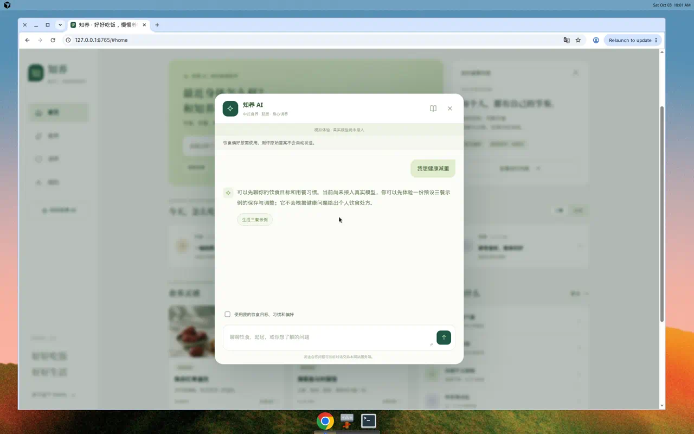

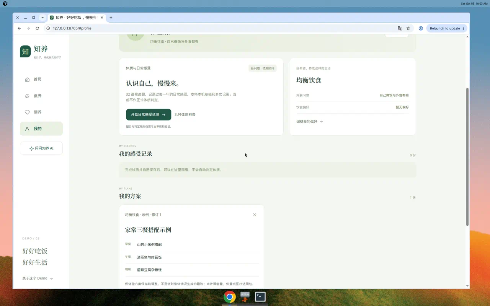

### 7.2 鱼换成豆腐后，午晚变成同一道菜

在修订 1 的方案里发送「不吃鱼，换成豆腐」后，午餐和晚餐都变成「菌菇豆腐杂粮饭」。早餐仍是山药小米粥。这是一条写死的替换：带「鱼」的那一餐被换成晚餐食谱，晚餐本身不变。

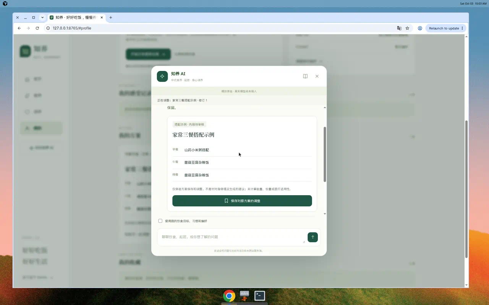

### 7.3 自由问题和基础病咨询是两条死路，文案却邀请继续问

「请分析完整舌象报告」的回复是：问题可以属于以后的咨询范围，当前模型未接入，请改走三餐、茶饮和本机记录。模式是 `unavailable`。

「我有高血压，日常吃什么需要注意？」的回复是：需要结合个人状况和用药，演示不提供个体茶方或治疗性饮食，请咨询医生、药师或营养人员，「你仍可询问一般食养知识」。模式是 `professional_help`，没有餐单。

后一句和实现不一致。敏感词会留在本次会话里。接着问「日常怎么吃」仍会碰到同一条闸门。只有「什么是……」这类科普句式能绕开，而且科普也是固定短句，不会检索高血压食养指南。产品方案允许回答有依据的一般知识；当前演示把基础病收成了拒绝。

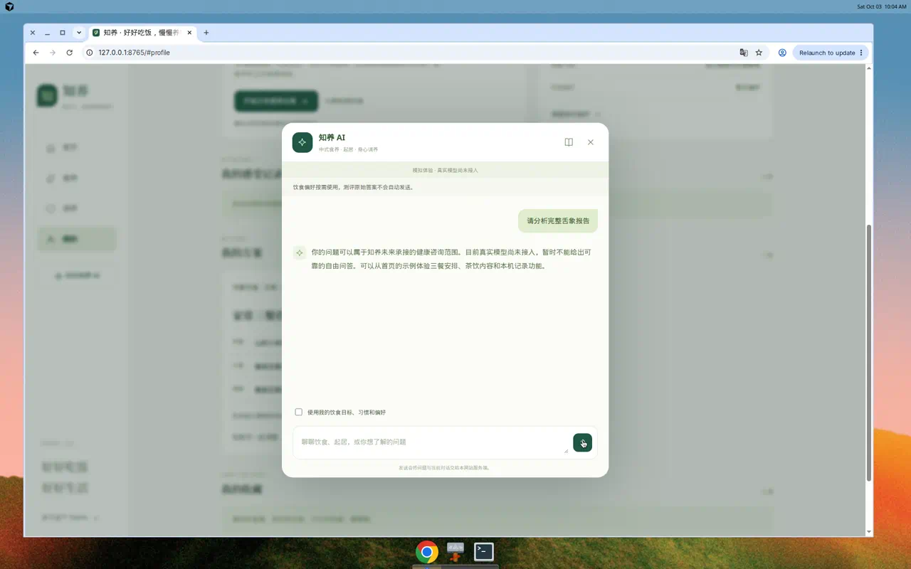

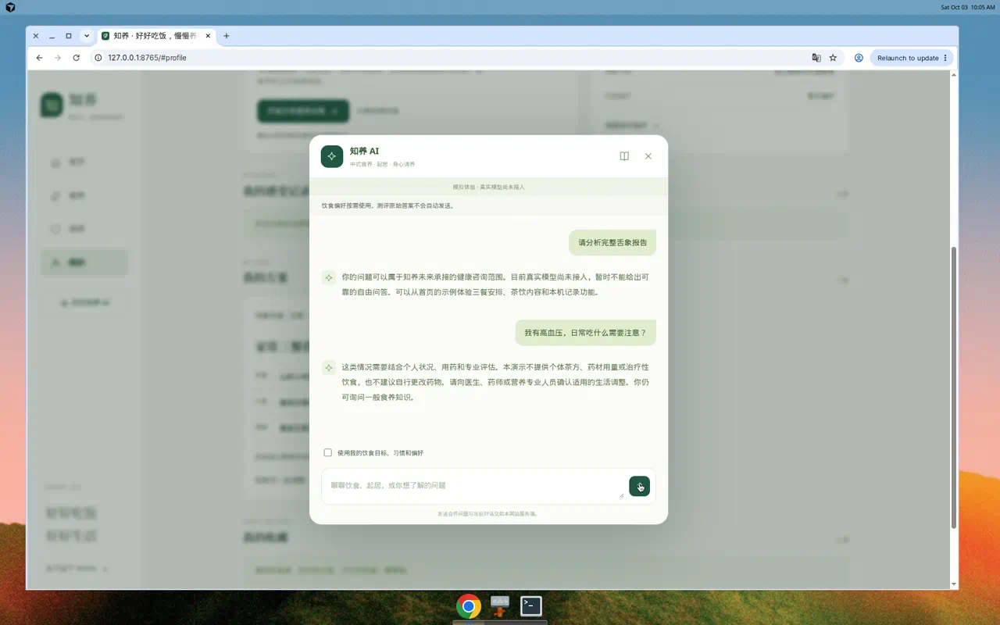

### 7.4 紧急提示是这条原型里最清楚的一段

「我现在呼吸困难」出现红色「请立即寻求专业帮助」，正文要求联系当地急救（中国大陆 120），并写明不要等待助手或继续找食养方案。同一屏没有方案、食谱或追问按钮。这条应在接模型时原样保留，放在模型调用之前。

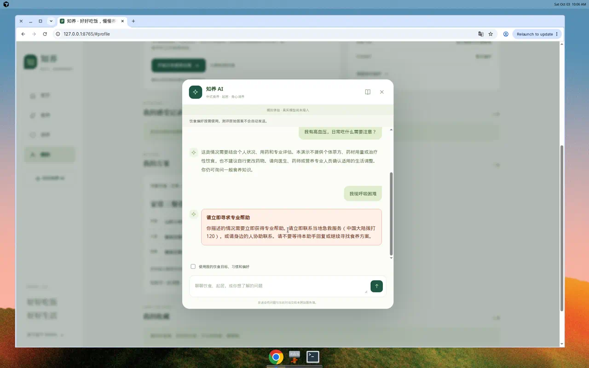

### 7.5 32 题是一题一屏

试测说明写清楚了：回顾过去一年、试测、不能正式判定体质、紧急不适不要继续答题。第 1 题是精力，八个选项含「记不清」「不适用」「不愿回答」。进度是「第 1 题 / 32 题」。

题目设计稿写的是每屏少量题。现在每题单独一屏，走完需要三十多次点击。结果页只列出选了「经常」或「几乎总是」的题干，不展示维度均分，也不给体质名。后半句符合安全边界。前半句使试测很难被用来做可理解性试测以外的事。

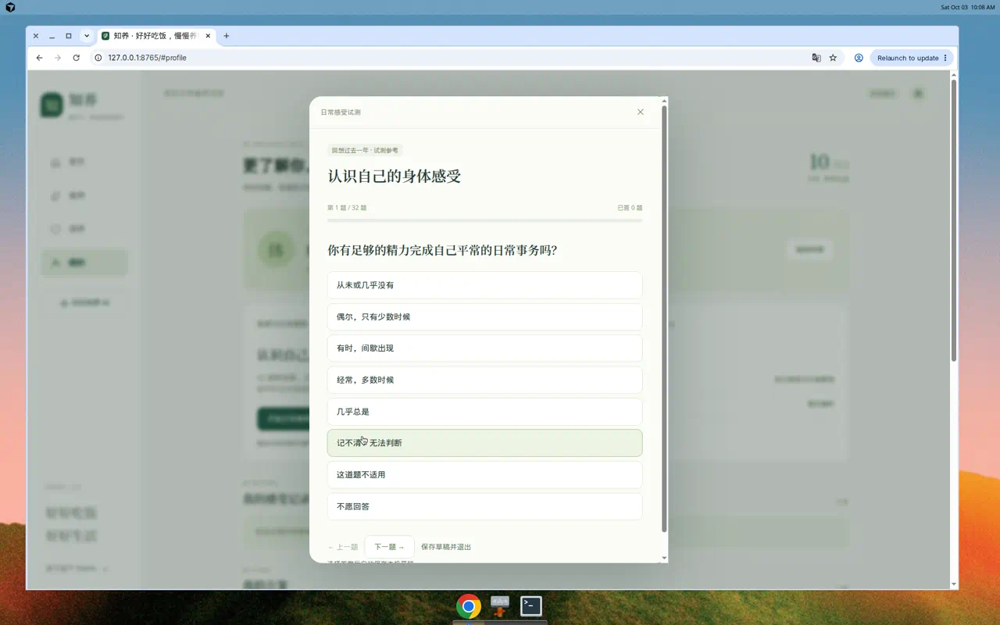

### 7.6 首页、食养、调养、手机布局

首页日期会写成当天（走查时是 10/03），三餐时间标着「示例」。食养页图片能加载，分类筛选可用。只有午餐和茶饮有照片，早餐、晚餐、加餐用图标。调养六个专题在，详情有适用边界。

`public/index.html` 里还留着旧骨架：日期「09/12」、时令「白露」、第三张卡是 22:30 的起居。脚本运行后会被换成现在的首页。脚本若没执行，用户看到的是另一版首页。

手机宽度下底部是首页、食养、调养、我的。咨询输入在对话框内，没有被底栏挡住。侧栏上的「问问知养 AI」在手机上会隐藏，入口靠首页主按钮。

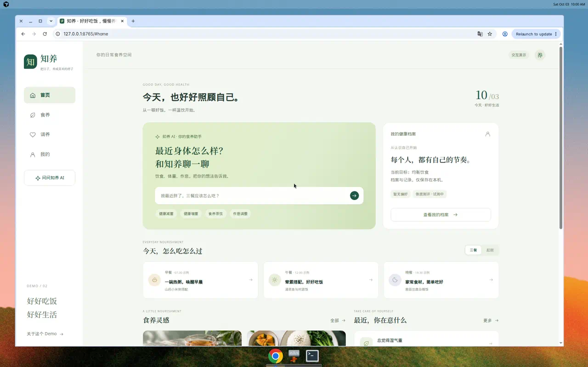

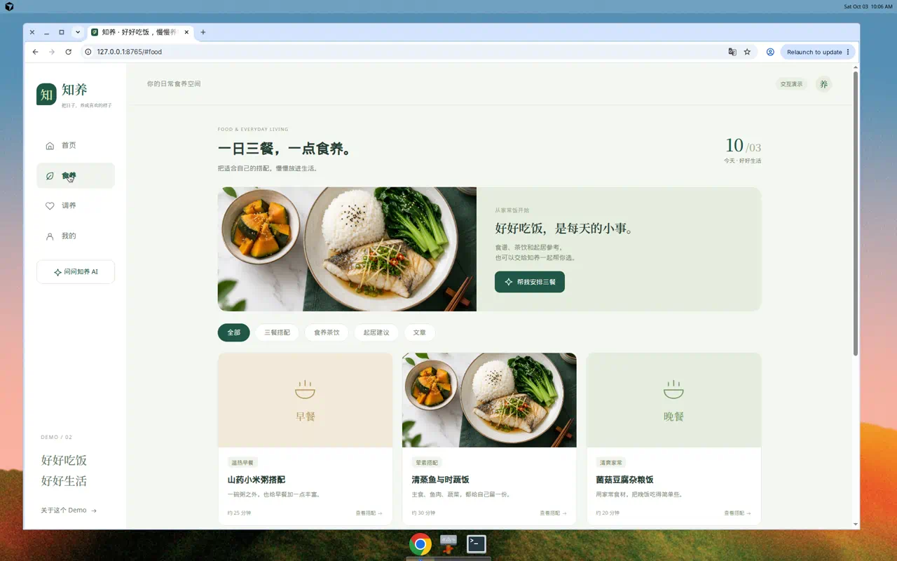

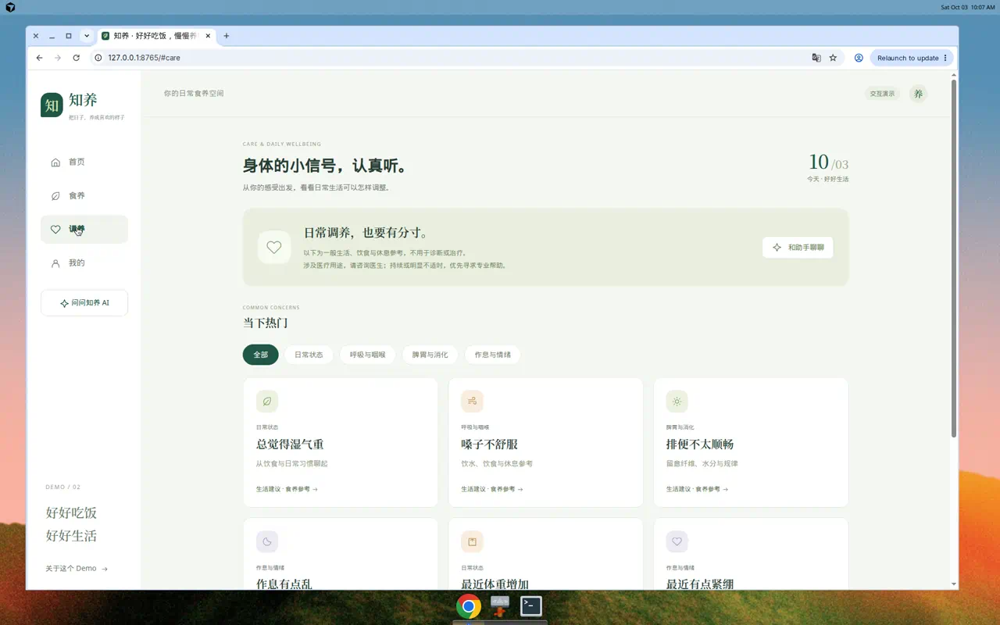

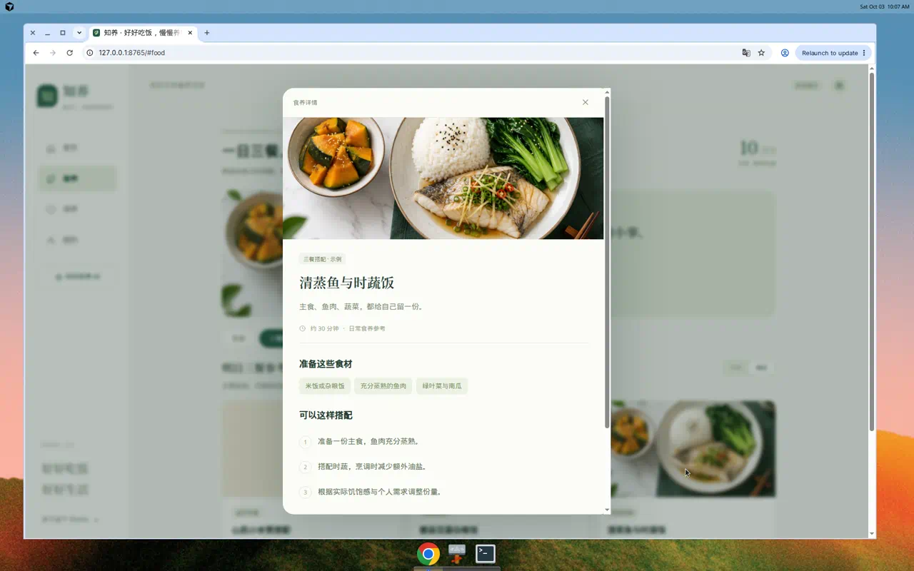

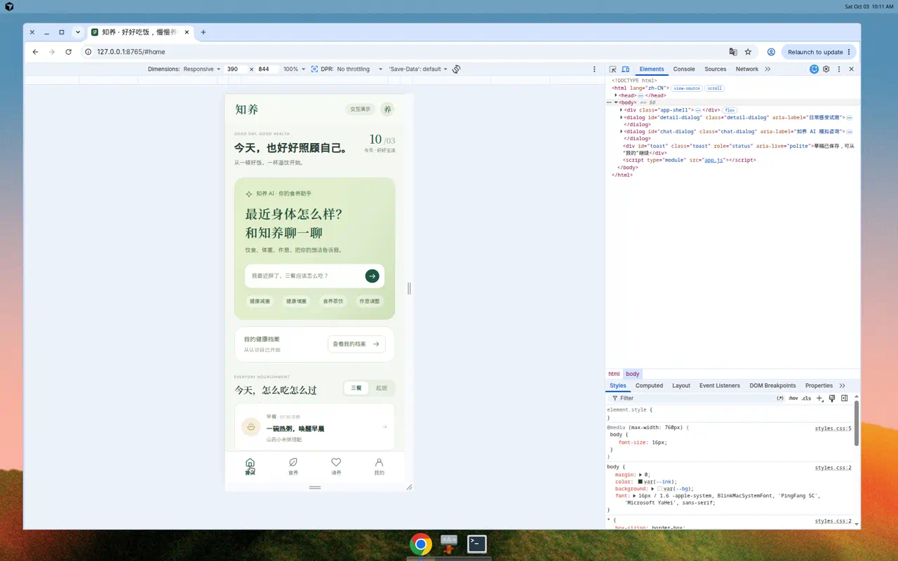

其他观感，优先级低：英文眉题（如 GOOD DAY, GOOD HEALTH）和中文正文并置；九种体质只有名称加一句提示；聊天刷新后清空，这点和方案一致，但要在「继续调整」入口上让人知道得到「我的方案」里再进，而不是在旧对话里找。

## 8. 代码结构，以及怎样接真实模型

### 8.1 现在的形状

| 文件 | 角色 | 状态 |
| --- | --- | --- |
| `src/client/app.js` | 四页模板、详情、咨询、全局点击 | 过大，接模型前应拆 |
| `src/client/styles.css` | 全部样式 | 同样是单文件，可以后拆 |
| `src/client/data.js` | 食谱、专题、文章、体质一句介绍 | 小而清楚，全部待审核 |
| `src/client/storage.js` | IndexedDB | 边界清楚 |
| `src/client/assessment-ui.js` | 32 题流程 | 已从页面主文件拆出 |
| `src/client/agent-client.js` | `POST /api/agent`，紧急句可离线返回 | 应保留 |
| `src/shared/assessment.js` | 计分 | 应保留，不要交给模型 |
| `src/shared/safety.js` | 紧急词、敏感词、回复结构 | 应保留在模型之外 |
| `src/shared/records.js` | 档案和方案校验 | 要放行非 `demo` 来源时再改 |
| `src/server/agent.js` | 校验、剧本、再校验 | 剧本以后只作为无密钥时的演示 |
| `src/server/index.js` | 同源、体积、实例内限流 | 限流是单进程计数，不能当成生产防护 |
| `rules/herbs.js` | 12 组配伍 | 未知不等于安全 |
| `content/questionnaire.json` | 候选题 | 版本 `zy-constitution-candidate-v0.1` |

`app.js` 末尾用 `document.modelContext.registerTool` 注册了两个只读工具：读演示概览、切换页面。这不是方案里的外部 MCP，也不要把它当成知识库接口。

### 8.2 接模型时的处理顺序

目标是换掉剧本的中间段，保留两头的检查。建议仍由 `src/server/agent.js` 的 `respond` 作为唯一出口，前端继续只调 `getAgentReply()`。

1. 浏览器：`agent-client.js` 先看紧急词。命中则直接返回固定求助文案，不发网络请求。
2. 服务端：`validateRequest` 检查长度、历史、食谱或专题编号是否真实存在。继续丢弃测评摘要。姓名不要加入请求。饮食偏好仍由用户勾选后才发送。
3. 调用模型之前：本轮消息和历史里若有明确紧急表述，返回 `urgentResponse`，函数在这里结束。
4. 调用模型之前：孕哺、婴幼儿、高龄、基础病、用药、过敏等敏感上下文，如果用户在要个人餐单、茶方或剂量，返回现在的 `professional_help`，不带 `planDraft`。这一步不要改成「交给模型自己小心」。
5. 调用模型之前：用户文本里的已知药名走 `checkHerbs`。状态为 `blocked` 时返回专业帮助。状态为 `unverified` 时，不允许模型把这些名字写进新配方。
6. 只有食养安排才调用模型。传入：当前问题、有限历史、可选的目标/习惯/偏好、正在调整的方案、允许使用的食谱清单（编号、标题、原料、做法、审核状态）。要求模型返回现有回复 JSON，餐次的 `recipeId` 必须来自清单。
7. 模型返回之后：再跑 `validateReply`、`validatePlan`、内容编号白名单，并对方案原料名再跑一次 `checkHerbs`。紧急或非 `answer` 模式若带方案，整段丢弃，改成对应的安全回复。检查失败则 `unavailable`，不要把模型原文展示出来。
8. 用户点击保存，才写入 IndexedDB。跟现在一样，聊天本身不落库。

无密钥：继续走现有 `runDemoAgent`，回复保留 `demo: true`，界面继续显示「模拟体验 · 真实模型尚未接入」。这条横幅现在写死在 `openChat` 里，不读返回字段。接入后要让横幅跟着是否真的调用了模型变化。

有密钥但超时、限额或结构不合法：返回 `unavailable`。不要在失败时改走关键词剧本。

实现时需要一起改的两处：

- `index.js` 里改成 `await respond(...)`。现在 `respond` 是同步函数，直接被放进 `JSON.stringify`。
- `validatePlan` 允许一个新的来源值（例如模型草稿），同时继续拒绝缺字段、过长和修订号冲突。演示数据可仍用 `demo`。

密钥只放服务端环境变量，不进仓库、不进浏览器、不写进日志。现有服务端本来就不记录问题正文，接上之后保持这样。供应商是否保留请求，要在选定服务后单独告知用户。

首版不必接 RAG 或 MCP。五个食谱用编号过滤就够。以后替换检索时，仍走第 7 步的白名单和配伍检查。

系统提示里需要写死的约束，和代码检查是同一件事的两边：只能引用给定食谱编号；不能新增药材、克数、疗程和疗效；不能在紧急或敏感个人方案场景里输出餐单；引用必须来自这次传入的来源列表。提示词不能代替第 3–7 步。

## 9. 建议暂时不要做的事

- 不要把 32 题接进咨询上下文，也不要根据均分显示体质名。
- 不要为了演示完整，把更多症状词加进 `agent.js`。
- 不要在内容仍是 pending 时，让模型生成陈皮红枣以外的茶方。
- 不要同时做账号体系和模型接入。D3 已经选了本机保存。
- 不要把单进程 40 次/分钟的计数当成可以公开调用模型的防护。真接入前要有访问边界和额度上限。

## 10. 本轮交付范围

本次验证通过的是：依赖安装、46 项测试、生产构建、本地预览，以及上面列出的浏览器路径。没有做的是：答完 32 题、专业内容审核、真实模型调用、生产部署。测试通过不表示健康规则已经能用于临床分诊。

`node scripts/check-docs.mjs` 在本环境没有跑完。它会检查文档里的本地链接，[产品方案](01-产品设计方案.md) 末尾有一条指向作者本机的绝对路径（`/Users/fansen/Desktop/.../过日子-竞品分析与产品拆解.html`），这里不存在该文件，脚本因此中断。本诊断文档自身的 22 条相对链接已单独核对通过。这不影响应用测试。

应用源码、问卷、规则和已有文档都没有在本轮修改。
